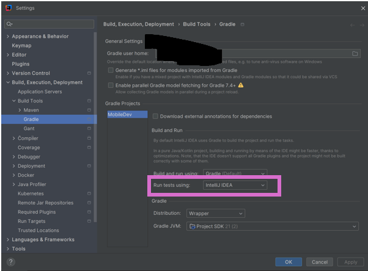

### Steps to Always Use JUnit for Tests in IntelliJ IDEA

1. **Set Default Test Runner**
    - Go to **File > Settings** (or **IntelliJ IDEA > Preferences** on macOS).
    - Navigate to **Build, Execution, Deployment > Build Tools > Gradle**.
    - Under the "Run tests using" section, select **IntelliJ IDEA** instead of **Gradle**.
    - Click **Apply** and **OK**.

   

This ensures that IntelliJ uses its built-in test runner (JUnit) for running tests rather than Gradle.
